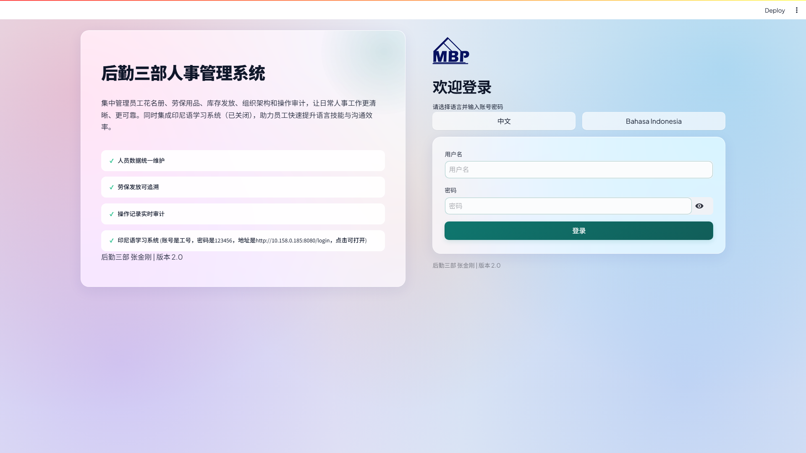
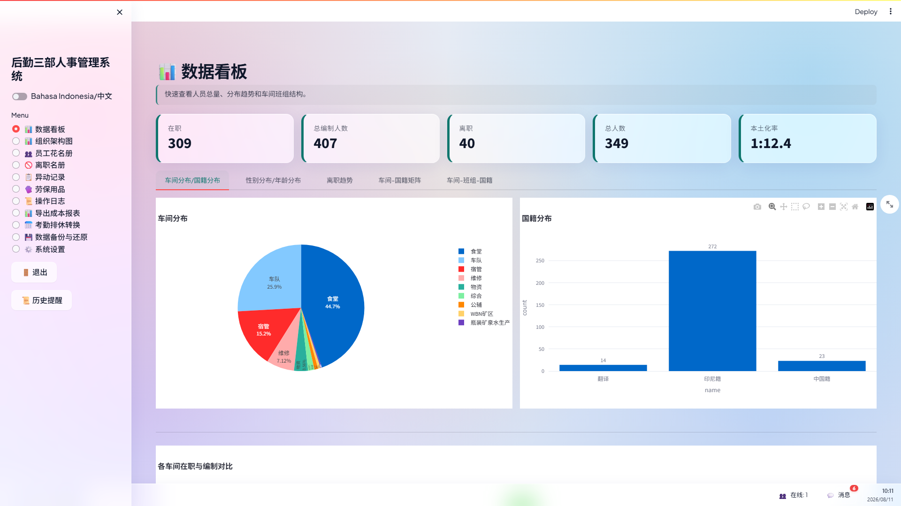
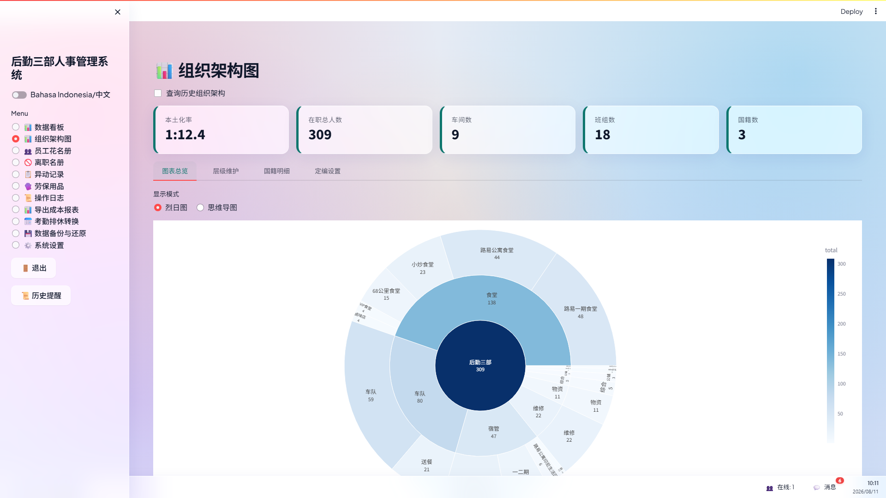
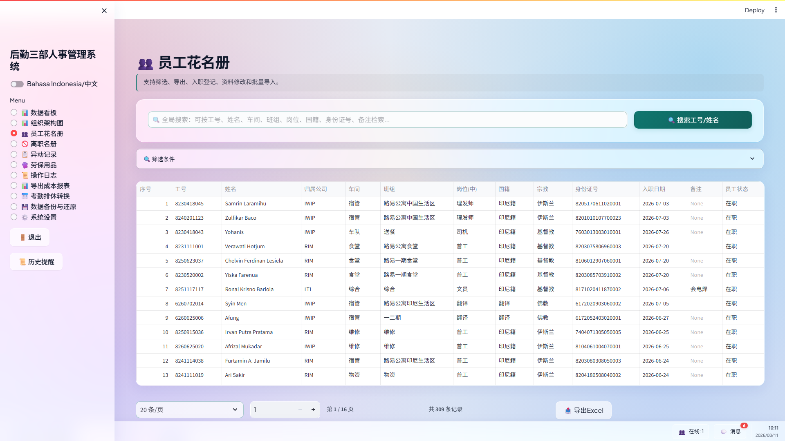
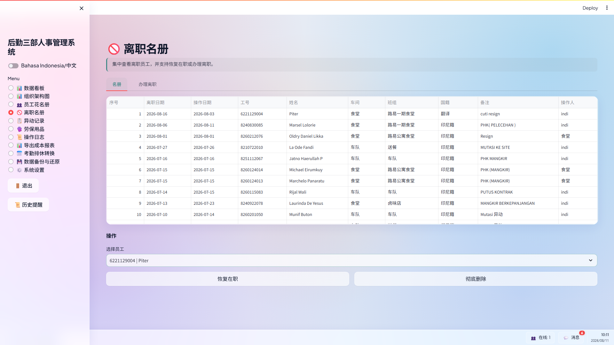
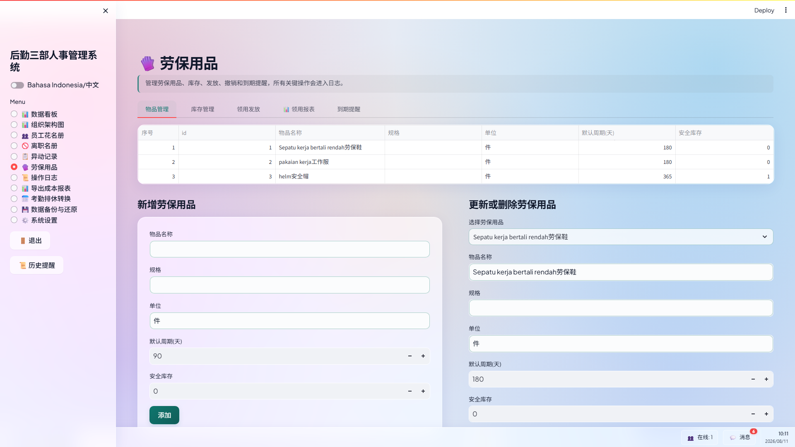
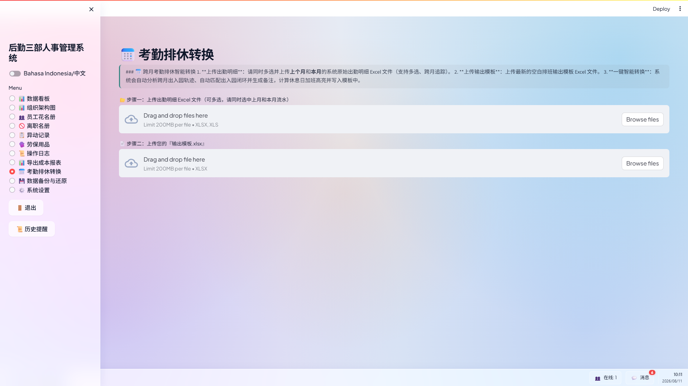
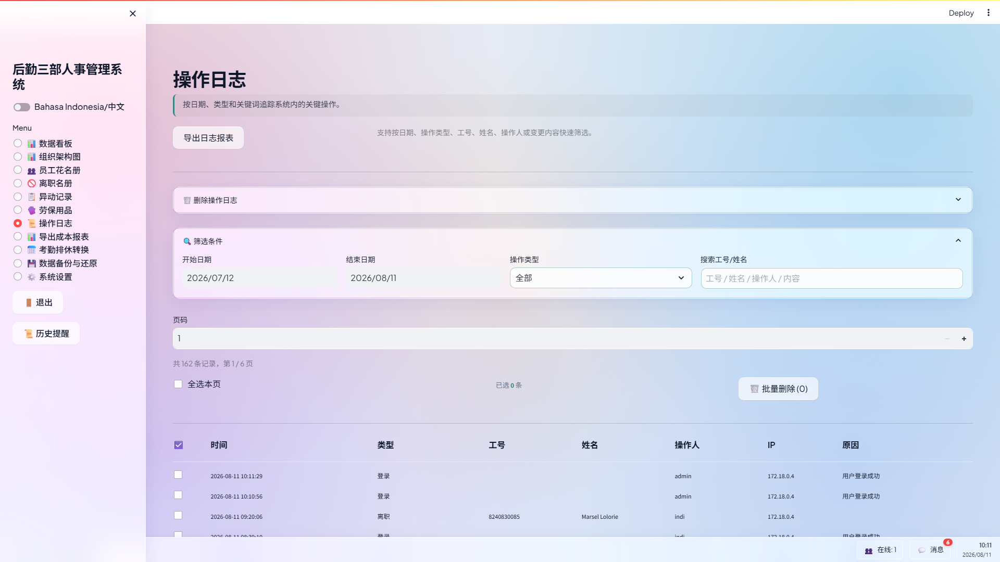
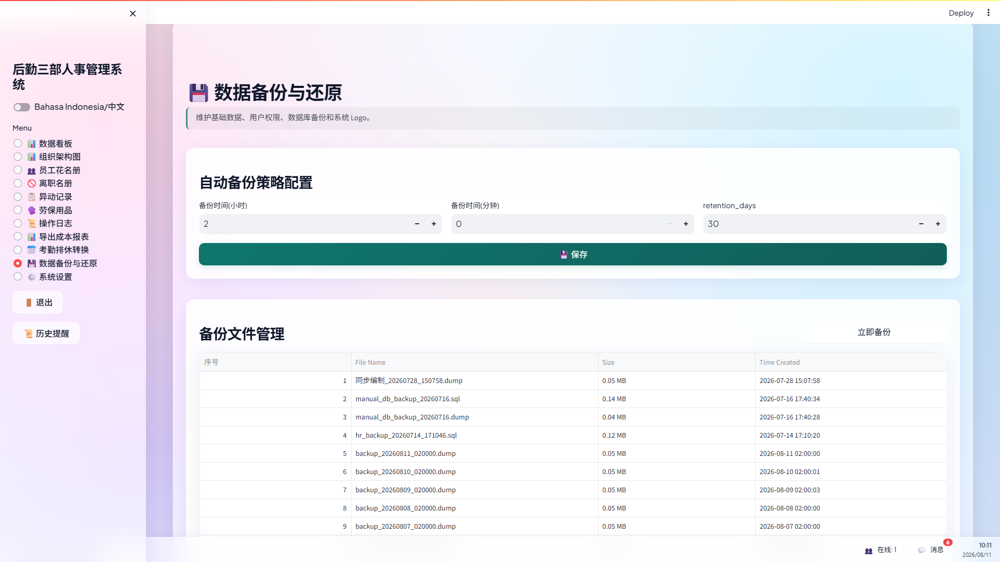
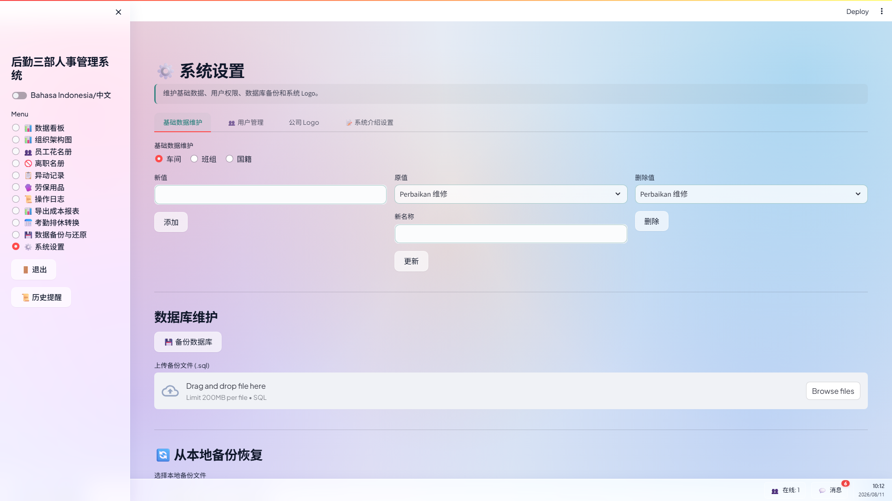

# 后勤三部人事与劳保管理系统 使用说明书 (v2.0 实际运行版)

**编制单位**：后勤三部 张金刚  
**适用对象**：后勤三部管理人员、HR 专员及车间主管  
**系统部署地址**：`http://localhost:8501`（局域网用户请访问服务器 IP）

---

## 一、 系统概述与总体架构

**后勤三部人事与劳保管理系统（v2.0）**是专门面向中印尼跨国工厂复杂作业环境打造的综合数字化管理平台。本系统旨在解决传统纸质档案查找困难、劳保用品领用无追溯、中印尼员工跨语言沟通障碍及考勤排休手动核算效率低下等核心痛点。

### 核心亮点
1. **中英/印尼双语实时切换**：满足中方管理人员与印尼本地员工的无缝协作需求。
2. **身份证件脱敏与安全控制**：自动掩码脱敏敏感身份证号，防范隐私泄漏。
3. **劳保全生命周期追溯与到期预警**：精确跟踪手套、安全鞋、安全帽等物资的发放与使用周期，自动触发预警。
4. **考勤排休智能转换**：一键对账打卡日志与排休模板，处理跨零点打卡及复杂考勤。
5. **自动化备份与灾备恢复**：支持每日自动备份与一键秒级还原，保障核心数据绝对安全。

---

## 二、 系统登录与安全认证

用户可通过局域网内部浏览器访问系统前端界面（默认端口 8501），系统提供严密的安全身份认证机制。

### 操作步骤
1. **访问系统**：打开 Edge / Chrome 浏览器，输入访问地址 `http://localhost:8501`。
2. **语言切换**：点击界面上方【中文】或【Bahasa Indonesia】按钮，系统将即时切换全界面语言。
3. **凭证录入**：在用户名输入框填入账号（如 `admin`），在密码框填入对应密码，点击【登录】按钮。
4. **快捷访问**：登录页底栏集成了印尼语在线学习系统的跳转链接与版本说明。

> 💡 **权限说明**：系统支持普通只读演示账号（如 viewer 角色）与超级管理员账号（admin 角色）的分级权限控制，演示账号可浏览所有模块但禁止修改与导出数据。

---

## 三、 数据看板与可视化决策

数据看板为管理者提供全盘人力资源与劳保状态的实时大盘视图。

### 核心指标与图表说明
- **人力核心指标卡**：顶部实时统计在职员工总数、中方员工数、印尼本地员工数、车间班组覆盖数及本月流失率。
- **本土化率分析**：通过高对比度饼图直观展示印尼员工占比（如本土化率达 85.5%），助力工厂管理本土化推进。
- **动态走势折线图**：展示近 12 个月在职与离职人数变化曲线，帮助预判用工高峰与流失趋势。
- **车间人员编制对比图**：柱状图对比各车间实际到岗人数与编制目标。
- **历史提醒挂件**：侧边栏【📜 历史提醒】聚合展示未来 7 天内员工生日及劳保物品即将到期的人员名单。

---

## 四、 组织架构图与本土化率

组织架构模块树状展现后勤三部下辖炼铁车间、烧结车间、动力车间等各个车间及班组的层级关系。

### 功能特色
1. **层级结构展示**：直观查看每个车间下属的各个生产班组与岗位配置。
2. **班组本土化率核算**：实时计算每个班组的中方与印尼籍员工比例。
3. **架构数据导出**：支持导出标准的 Excel 组织架构表，便于上报与汇总。

---

## 五、 员工花名册全局管理

员工花名册是系统的核心基础数据库，管理全厂员工的全生命周期档案。

### 核心功能操作
- **即时模糊搜索**：在顶部【实时搜索】框中输入工号（ID Nomor）或姓名（Nama），无需回车即可实时筛选表格。
- **批量导入与模版**：点击【批量导入员工】，可先下载标准 Excel 模版，填妥后上传一键导入大量人员数据。
- **档案新增与修改**：支持录入工号、姓名、国籍、车间、班组、岗位、入职日期、联系电话及身份证号。
- **敏感数据脱敏**：非高特权用户查看花名册时，身份证号自动显示为 `3201************12`，兼顾管理与隐私合规。

> 💡 **级联更新机制**：修改员工工号时，系统会自动级联更新其历史异动记录、劳保领用日志及审计日志，确保数据完整性。

---

## 六、 离职名册与人员动态管理

离职名册负责妥善归档所有离职人员档案，并提供完善的档案复原机制。

### 离职与复职流程
1. **办理离职**：在花名册中选中员工点击【办理离职】，填写离职日期与离职原因（如个人原因、合同到期），系统自动将其转入离职名册。
2. **档案归档**：离职名册完整保留员工离职前所在车间、工号、离职时间及经办人信息。
3. **一键复职**：若离职员工重新入职，管理员可在离职名册中点击【一键复职】，即可将其无缝还原回在职花名册并保留历史档案。

---

## 七、 劳保用品全生命周期管理

劳保管理模块实现了后勤三部所有劳保用品（安全帽、防护服、安全鞋、手套、口罩等）的采购、库存、发放、领用及到期预警全流程数字化。

### 业务办理说明
- **劳保品类与库存维护**：定义劳保物资规格、单价及标准使用周期（如安全鞋周期 180 天）。
- **入库与出库登记**：记录供应商入库及车间领用出库数量，实时更新库存余额。
- **领用发放与对账**：选择指定员工并发放劳保用品，系统自动根据上一次发放时间与标准周期推算下一次预计领用日期。
- **到期预警与提醒**：当员工劳保领用达到或超过周期时，主界面与任务栏弹出橙色预警提醒，支持批量导出领用签收单。

---

## 八、 考勤排休自动化转换

针对工厂复杂的轮班与排休制度，系统提供了一键式打卡日志与排休模板智能对账转换功能。

### 转换操作步骤
1. **上传刷卡日志**：在【上传考勤日志】区拖拽上传门禁机/打卡机导出的 Excel 明细表。
2. **上传排休模板**：在【上传排休模板】区上传标准排休安排 Excel 表。
3. **一键转换**：点击【🚀 开始考勤转换】，系统算法在后台自动完成零点跨天匹配、迟到早退判定及排休覆盖计算。
4. **下载结果**：转换完成后，直接点击【💾 下载考勤结果文件】获取标准对账分析表。

---

## 九、 操作审计日志与安全管控

系统内置合规性审计日志模块，记录所有涉及数据写、改、删及配置变更的操作。

### 审计追溯功能
- **详细记录内容**：包括操作时间、操作员账号、客户端 IP 地址、操作类型（入职/修改/离职/异动）以及变更前与变更后的完整 JSON 差异。
- **条件检索**：支持按工号、姓名或时间范围快速检索特定操作记录。
- **日志导出**：支持将合规审计日志导出为标准 Excel 文件以备安全检查。

---

## 十、 数据库自动化备份与容灾

为防止突发硬件故障或误操作造成数据丢失，系统配备了全自动数据库备份与秒级容灾还原机制。

### 备份与还原管理
1. **自动定时备份**：管理员可设置每日定时备份时间（如凌晨 02:00）及快照保留天数（默认 7 天），过期备份自动清理。
2. **立即备份**：点击【立即备份】可实时创建全量 SQL 数据库快照。
3. **一键秒级还原**：选中历史备份快照点击【还原】，系统弹出二次确认窗口，确认后即可完成数据库全量还原。

---

## 十一、 系统设置与参数维护

系统设置模块提供基础元数据、用户权限账号、企业 Logo 及登录页公告的全局配置。

### 配置项说明
- **元数据维护**：动态维护车间列表、班组列表及员工国籍字典。
- **用户与权限管理**：支持管理员添加新用户账号，分配 `admin`（管理员）或 `viewer`（只读视角）角色，并支持重置密码。
- **企业 Logo 自定义**：上传企业专属 Logo 图片，系统顶部与任务栏图标自动同步替换。
- **登录公告管理**：可编辑登录页的中英/印尼双语欢迎词与通知公告。
