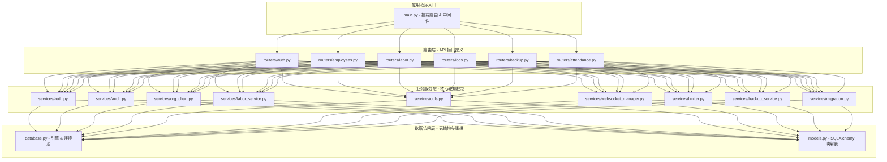

# 后勤三部人事管理系统 (Personnel Management System)

这是一个专为后勤三部设计的高端人事与劳保管理系统。系统整合了员工花名册管理、劳保用品领用生命周期管理、组织架构动态图谱配置、车间数据权限控制以及系统审计备份功能。

---

## 🎨 视觉设计 (Premium Glassmorphism UI)
前端界面采用 **Apple 风格毛玻璃设计 (Glassmorphism Layout)**，打造极致的质感与现代感：
*   **炫彩背景**：集成自适应系统深浅色模式的动态炫光梯度底色。
*   **玻璃面板**：半透明毛玻璃层级容器，高对比度细腻边框处理。
*   **高对比度表单**：输入框与下拉选择框具备 1.5px 粗细的高对比度激活状态边框，完美解决低对比度下的视觉障碍。
*   **响应式布局**：完美适配不同大小的屏幕终端。

---

## 💡 核心业务功能 (Core Business Features)
*   **组织架构本土化率动态展示**：在组织架构图上部的显著位置，首位卡片新增了“本土化率”指标，系统基于国籍分布自动计算该数据（非中国籍/中国籍人数比例）。在启用“查询历史组织架构”时，卡片指标会同步且动态计算并展示对应历史时期的整体本土化率。
*   **入职与离职双趋势分析**：数据看板内的趋势图由单一的“离职趋势”升级为“入职与离职趋势”双折线图，同屏直观对比展示每月新入职登记人数和离职人数，助力管理层快速掌握用工流入流出及人员流动走势。

---

## 🔧 架构设计 (MVC Architecture)
经过代码治理与解耦，后端系统已完全升级为规范的多层模块化架构：



### 模块结构说明：
1.  **[main.py](file:///d:/WEB_SYSTEM/main.py)**：整个后端的启动入口，负责全局配置加载、启动环境检查、自动数据库结构迁移升级、CORS与限流中间件挂载，以及路由器分发。
2.  **[database.py](file:///d:/WEB_SYSTEM/database.py)**：负责数据库连接生命周期管理、连接池优化参数设置（`pool_size=10`, `max_overflow=20`）及 `get_db` 依赖注入。
3.  **[models.py](file:///d:/WEB_SYSTEM/models.py)**：声明所有 SQLAlchemy 数据表结构，建立规范的数据实体映射。
4.  **`routers/`**：
    *   [auth.py](file:///d:/WEB_SYSTEM/routers/auth.py)：用户身份验证、管理用户、实时 WebSocket 在线用户列表、ARP MAC/IP 心跳探测。
    *   [employees.py](file:///d:/WEB_SYSTEM/routers/employees.py)：花名册搜索、新增与批量导入Excel、岗位异动、彻底删除、花名册与财务成本分析 Excel 导出、组织架构图谱定义。
    *   [labor.py](file:///d:/WEB_SYSTEM/routers/labor.py)：劳保用品目录、出入库管理、领用分配发放、记录撤销与到期未换发自动提醒。
    *   [logs.py](file:///d:/WEB_SYSTEM/routers/logs.py)：系统审计操作日志、通知历史大屏看板。
    *   [backup.py](file:///d:/WEB_SYSTEM/routers/backup.py)：自动备份策略配置、手动触发备份、备份文件列表查询及数据库后台异步恢复。
    *   [attendance.py](file:///d:/WEB_SYSTEM/routers/attendance.py)：考勤模板与考勤文件解析、上传及查询。
5.  **`services/`**：包含解耦出的无状态核心逻辑计算服务及数据治理服务：
    *   [backup_service.py](file:///d:/WEB_SYSTEM/services/backup_service.py)：定时备份任务、旧备份自动清理、备份转码及还原底层逻辑。
    *   [migration.py](file:///d:/WEB_SYSTEM/services/migration.py)：数据库全自动结构迁移升级逻辑。
    *   其他包括国籍清洗、生日提醒、限流计算等各类业务工具类。

---

## 🛡️ 安全与权限控制 (Security & Permissions)
*   **敏感管理功能限制**：系统审计操作日志的清空与批量删除、以及数据库备份与还原策略的配置和手动执行，仅允许系统超级管理员账户 (`username == "admin"`) 进行操作，防止越权日志篡改和关键备份数据泄露。其他管理员角色用户只具备常规的员工与劳保数据管理功能，无法删除系统操作日志或查看数据备份。
*   **离职人员操作追踪**：离职名册中增加操作人 (`resign_operator`) 跟踪显示，并在员工离职登记时自动追踪记录办理离职的具体管理员。同时，离职名册中的表头通过多语言翻译引擎实现了中印双语的完整翻译展示，避免了字段名原始数据库键（如 `ws_bengkel`）的直接暴露。

---

## 💾 自动备份与容灾恢复 (Backup & Disaster Recovery)
系统提供全自动与手动的双重安全机制，彻底解决因 Docker 容器重构、磁盘损坏等原因引起的数据丢失风险：
*   **本地硬盘自动备份**：系统利用后台任务调度器，默认在每天凌晨 **02:00** (东京时间) 自动对 PostgreSQL 数据库执行导出（使用 pg_dump 并以自定义压缩格式 `-Fc` 输出）。备份文件自动存放于宿主机本地硬盘目录 **`d:\WEB_SYSTEM\backups`** (通过 `./backups` 挂载)，即使删除 Docker 容器或虚拟卷，核心数据依旧完好。
*   **自动过期清理**：系统会自动保留最近 **7 天** 的备份文件，并在每次备份完成后自动清理超过保留期限的旧备份文件，防止宿主机磁盘被占满。
*   **一键安全还原**：管理员可通过后端接口一键从本地备份恢复。还原逻辑中集成了字符编码检测，可自动将非 UTF-8 编码的旧备份文件（如 `GBK`、`Latin-1` 等）转码为 `UTF-8` 执行还原，还原完成后全自动执行数据库模式升级迁移。
*   **静态资源防丢机制**：系统上传目录挂载配置已优化为本地直通挂载（`./uploads:/app/uploads`），确保用户上传的 Logo 图像、Excel 导入文件等静态资源能无损地与数据库一同存放在本地硬盘上。

---

## 🛠️ 技术栈 (Technology Stack)
*   **后端 (Backend)**：FastAPI, SQLAlchemy ORM, Uvicorn, SlowAPI (限流保护), PyJWT (加解密身份 Token), pandas (报表解析)
*   **前端 (Frontend)**：Streamlit, Plotly (交互式图表), Javascript Websocket Client
*   **数据库 (Database)**：PostgreSQL 15
*   **部署工具 (DevOps)**：Docker, Docker Compose, Multi-stage Builds (多阶段镜像优化)

---

## ⚡ 容器优化 (Containerization Features)
*   **多阶段构建 (Multi-Stage Build)**：[Dockerfile.backend](file:///d:/WEB_SYSTEM/Dockerfile.backend) 采用构建级与运行时级双阶段设计，去除多余的编译链，降低宿主机资源消耗。
*   **原生健康检测**：移除了需要启动 Python 环境的重量级 Healthcheck，全部采用内嵌 `curl` 对健康接口进行毫秒级探测，性能开销趋近于 0。

---

## 🚀 部署与运行 (Quick Start)

### 1. 配置环境变量 (Environment Variables)
在 `docker-compose.yml` 中或宿主机环境变量中设置：
*   `DATABASE_URL`：数据库连接串，例如：`postgresql://admin:iwip123@db:5432/hr_system`
*   `SECRET_KEY`：JWT 签名私钥，生产环境请务必更改。

### 2. 启动服务 (Launch)
在项目根目录下，执行一条命令编译并启动所有容器服务：
```bash
docker compose up -d --build
```

### 3. 服务地址 (Services Ports)
*   **前端展示界面**：[http://localhost:8501](http://localhost:8501)
*   **后端 API 文档 (Swagger UI)**：[http://localhost:8000/docs](http://localhost:8000/docs)
*   **后端 API 接口**：[http://localhost:8000/api](http://localhost:8000/api)